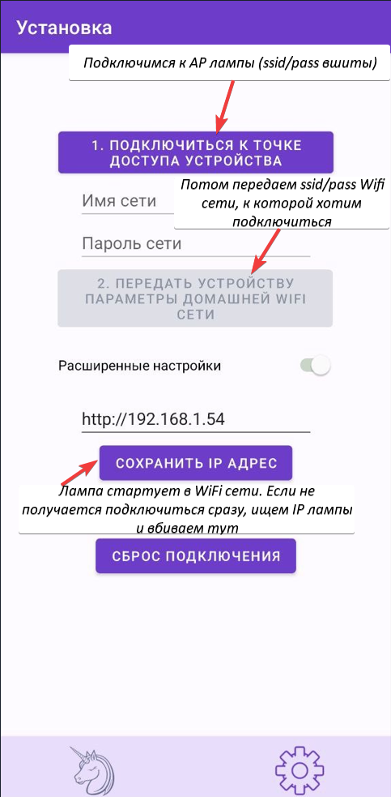

# 🦄Светодиодная Лампа-Единорог на ESP8266 + Android приложение | DIY Unicorn LED Lamp on ESP8266 With Android app
Проект LED лампы с управлением по WiFi через Android приложение.

STL файлы для 3d печати: [Unicorn LED nightlight](https://www.thingiverse.com/thing:5334985)

Прошивка создана на основе проекта @AlexGyver [Огненная Wi-Fi Лампа GyverLamp Своими Руками](https://alexgyver.ru/gyverlamp/). 

Лампа поддерживает несколько световых эффектов, также позволяет управлять цветом и яркостью. Управлять состоянием можно либо по сенсорной кнопке (спрятана в корпус), либо через Android приложение.
Демонстрация работы:
- [Режим "rainbow"](./img/rainbow.gif)
- [Режим "fire"](./img/fire.gif)
- [Режим "confetti"](./img/confetti.gif)
- [Также есть режим свечения одним цветом (с выбором этого цвета)](./img/color.png)

## 🛠️ Материалы 
- Корпус - напечатан на 3D принтере. Пластик: белый PLA, черный PETG. 
- Плата c ESP8266 - у меня NodeMCU Lua Mini V2 (1 шт).
- Модуль с сенсорной кнопкой TTP223 (1 шт). 
- Светодиодная адресная лента WS2812 (в корпус влезло 24 "лампочки").
- Гнездо для блока питания (5.5×2.1).
- Блок питания 5V 3A.

## 🛜 Прошивка на ESP8266

Основной код прошивки лежит в файле [sketch_full.ino](./server_esp8266/sketch_full/sketch_full.ino). Часть кода, связанного с отдельными компонентами, вынесена в отдельные файлы:
- [EEPROMHelper.h](./server_esp8266/sketch_full/EEPROMHelper.h)
- [LedStripHelper.h](./server_esp8266/sketch_full/LedStripHelper.h)
- [WebServerSecureHelper.h](./server_esp8266/sketch_full/WebServerSecureHelper.h)

Прошивка работает так:
1. При включении выполняем инициализацию компонентов - кнопки, LED ленты, EEPROM.
2. Пытаемся стартовать веб сервер в локальной WiFi сети. Для этого считываем SSID и пароль сети из памяти, и используем их для подключения ESP к сети.
3. Если удалось, стартует веб сервер (`initServer`) с методами:
    - `/modes` - получить доступные режимы работы лампы на клиент
    - `/state HTTP_GET` - получить текущее состояние лампы на клиент
    - `/state HTTP_POST` - сохранить изменение состояния лампы (режим, цвет, яркость) с клиента на сервер
    - `/reset` - сброс подключения
4. Если это не удалось, лампа стартует в Access Point режиме (метод `initAuthServer`). В этом режиме сервер имеет два метода: `/setup` и `/reset`. Метод `/reset` сбрасывает сохраненные настройки сети. Метод `/setup` принимает SSID и пароль сети, сохраняет их в EEPROM для дальнейшей работы. После этого ESP пытается переключиться в режим STA с этими настройками. 
> [!NOTE]
>Так как SSID и пароль всё же чувствительные данные, передаем их по HTTPS. Для этого генерируем [self-signed сертификат](https://tecadmin.net/step-by-step-guide-to-creating-self-signed-ssl-certificates/) с долгим сроком действия. В этом случае передаваемые данные будут зашифрованы. Сертификат прописывается в [WebServerSecureHelper.h](./server_esp8266/sketch_full/WebServerSecureHelper.h)

>[!NOTE]
>Подключения по HTTPS на ESP едят много памяти. Поэтому количество одновременных подключений к серверу ограничено (`WiFi.softAP(tempSsid, tempPass, 1, 2, 1)`). Да нам и не надо много для этого сценария.

5.  Пытаемся загрузить последнее сохраненное состояние лампы (яркость, режим работы). Если нет, включаем режим "по умолчанию".
6. При переключении режима по кнопке или через приложение, состояние лампы сохраняется в память EEPROM - чтобы восстановиться на следующем включении лампы.

Собрать прошивку можно в Arduino IDE. 

# 📱 Android приложение
Приложение написано на Kotlin. Содержит два фрагмента: для экрана управления (`HomeFragment`) и для экрана настроек (`SetupFragment`). 

При загрузке приложение пытается подключиться к лампе. Если это не удается, перенаправляем пользователя на экран настроек. Иначе, остаемся на экране управления и отображаем элементы управления состоянием лампы.

Основные файлы приложения:
- [HomeFragment.kt](./client_android_kotlin/app/src/main/java/com/procrastinationcollaboration/miraunicornledlamp/ui/home/HomeFragment.kt) / [HomeViewModel.kt](./client_android_kotlin/app/src/main/java/com/procrastinationcollaboration/miraunicornledlamp/ui/home/HomeViewModel.kt) - код для экрана управления
- [SetupFragment.kt](./client_android_kotlin/app/src/main/java/com/procrastinationcollaboration/miraunicornledlamp/ui/setup/SetupFragment.kt) / [SetupViewModel.kt](./client_android_kotlin/app/src/main/java/com/procrastinationcollaboration/miraunicornledlamp/ui/setup/SetupViewModel.kt) - код для экрана настройки
- [Http сервисы](./client_android_kotlin/app/src/main/java/com/procrastinationcollaboration/miraunicornledlamp/services/) - HTTP сервисы для подключения к лампе
- [DataStoreRepository.kt](./client_android_kotlin/app/src/main/java/com/procrastinationcollaboration/miraunicornledlamp/repositories/DataStoreRepository.kt) - хранилище настроек приложения (в данном случае, IP адреса сервера LED лампы)
- [MainActivity.kt](./client_android_kotlin/app/src/main/java/com/procrastinationcollaboration/miraunicornledlamp/MainActivity.kt) - стартовая Activity приложения: содержит навигацию, стартовую логику.

Используемые библиотеки:
- Retrofit и Moshi - для HTTP сервисов
- Hilt - для dependency injection (используется для инъекции единого экземпляра Data Store)
- SkyDoves ColorPickerView - компонент для выбора цвета

> [!NOTE] 
> Для работы с HTTPS сервером необходимо положить сертификат, используемый в ESP прошивке, в проект Android приложения - в папку `res/raw`.

Приложение надо собрать в Android Studio в релизной версии, как APK файл. А далее установить приложение на телефон, игнорируя предупреждения о "мы не знаем, кто это приложение сделал" :)

>[!NOTE]
> В настройках есть возможность вписать IP адрес лампы. Это нужно для случая, когда IP адрес "по умолчанию" занят, и лампа стартует на другом. IP можно посмотреть в панели управления WiFi роутера.

Скриншоты UI:
- [Управление - режим "Цвет"](./img/4.ui-2.jpg)
- [Управление - режим эффектов без задания цвета](./img/3.ui-1.jpg)
- [Главный экран в случае отсутствия связи с лампой](./img/1.firstConn.jpg)

## 🔧 Сборка
Схема сборки полностью идентична схеме из проекта Alex Gyver'а, и подсмотреть ее можно [тут](https://alexgyver.ru/wp-content/uploads/2021/06/schemeEPIC.jpg).

## 🔌 Подключение

## 🤔 Могло быть лучше...
Всё могло быть лучше :) Но в первую очередь, я могу подумать о следующих улучшениях:
- Обновление прошивки по WiFi.
- Отключение лампы по таймеру.
- Корпус по STL модели получается неразборным. Разборный был бы лучше.
- Использовать аккумуляторы вместо БП - также требует доработки корпуса.

Также интересно было бы использовать MQTT сервер. Сейчас лампой управлять можно только по локальной сети, а MQTT позволил бы избежать этого ограничения.